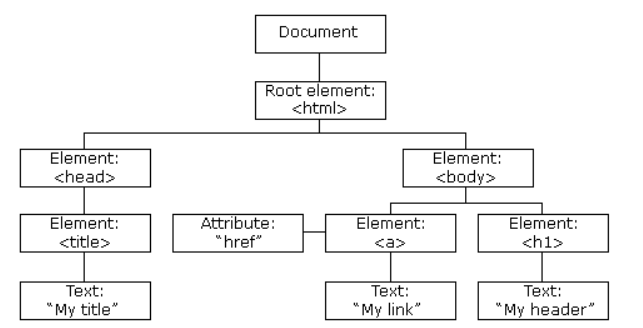
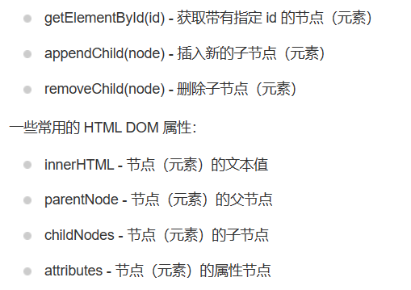
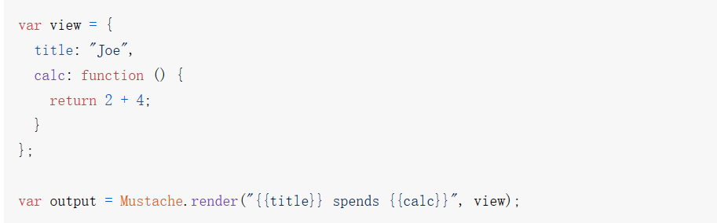

# vuejs笔记
### vue是一种渐进式框架，可以部分或全部应用在前端工作中
编写风格：vue2选项式api，vue3组合式api 

文件初始化：
* 切到目录下：`npm init vue@latest`
* 输入项目名称： 不要使用大写
* 镜像安装npm：`cnpm install`
  * 安装好后会生成`node_modules`文件夹，它包含node的运行依赖库
  * 资源文件夹`public`
  * 配置跨域打包等等`vite.config.js`
  * 源码文件夹`src`
* 按教程搭建vscode开发环境

 vue可以声明式的将其组件实例的数据绑定到呈现的DOM上，它可以被HTML解析器正常的解析

###HTML的DOM
DOM（Document Object Model）文档对象模型


对于代码:
```
<html>
  <head>
    <meta charset="utf-8">
    <title>DOM 教程</title>
  </head>
  <body>
    <h1>DOM 课程1</h1>
    <p>Hello world!</p>
  </body>
</html>
```

* `<html>` 节点没有父节点；它是根节点
* `<head>` 和 `<body>` 的父节点是 `<html>`节点
* 文本节点 `"Hello world!"` 的父节点是`<p>`节点
* `<head>` 节点拥有两个子节点：`<meta>` 与 `<title>` 节点
* **注意**：DOM 处理中的常见错误是希望元素节点包含文本。

DOM常用方法：



HTML DOM 属性: 属性是节点（HTML 元素）的值，您能够获取或设置。

`var txt=document.getElementById("intro").innerHTML;`

DOM的事件绑定：

```
<button onclick="displayDate()">点我</button>

<script>
function displayDate()
{
    document.getElementById("demo").innerHTML=Date();
}
</script>

<p id="demo"></p>
```

DOM的节点绑定

###文本插值
最基本的数据绑定形式，使用的是Mustache语法（双大括号）
Mustache语言是为了使用户界面与业务数据（内容）分离而产生。



